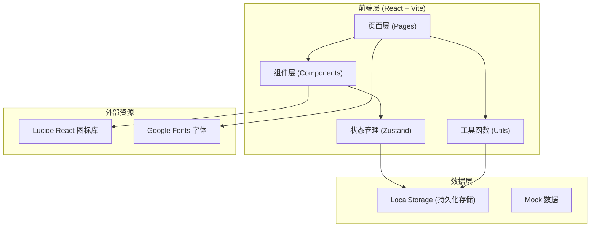
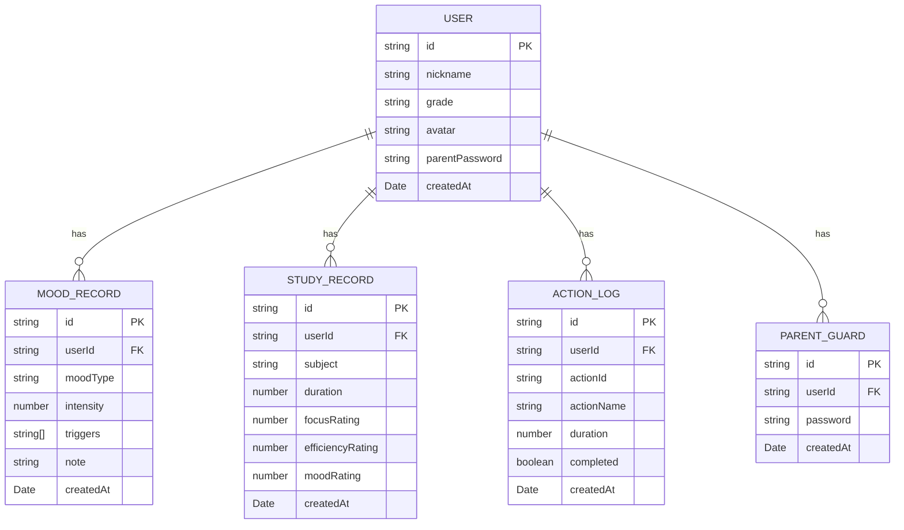

# 晴语·青少年成长伙伴 技术架构文档

## 1. 架构设计



---

## 2. 技术选型说明

| 层级 | 技术 | 版本 | 说明 |
|------|------|------|------|
| 前端框架 | React | 18.x | 组件化开发，生态丰富 |
| 开发构建 | Vite | 5.x | 极速开发体验，热更新 |
| 类型系统 | TypeScript | 5.x | 类型安全，减少bug |
| 样式方案 | Tailwind CSS | 3.x | 原子化CSS，高效开发 |
| 状态管理 | Zustand | 4.x | 轻量、简洁、高性能 |
| 路由管理 | React Router | 6.x | 声明式路由 |
| 图表库 | Recharts | 2.x | React图表组件库 |
| 图标库 | Lucide React | latest | 精美线性图标 |
| 数据持久化 | LocalStorage | - | 浏览器本地存储 |

---

## 3. 路由定义

| 路由路径 | 页面名称 | 说明 |
|----------|----------|------|
| `/` | 首页仪表盘 | 情绪速览 + 学习概览 + 快捷入口 |
| `/mood` | 情绪记录 | 记录心情 + 情绪历史 |
| `/mood/insight` | 情绪洞察 | 趋势分析 + 数据图表 |
| `/study` | 学习记录 | 专注计时 + 学习历史 |
| `/actions` | 微行动中心 | 微行动列表 + 分类 |
| `/actions/:id` | 微行动执行 | 3分钟引导练习 |
| `/parent` | 家长守护验证 | 密码输入 |
| `/parent/dashboard` | 家长守护总览 | 数据总览 + 风险预警 |
| `/parent/crisis` | 危机引导 | 心理援助资源 |
| `/profile` | 个人中心 | 个人信息 + 设置 |

---

## 4. 数据模型

### 4.1 数据模型定义



### 4.2 数据类型定义

```typescript
// 情绪类型
type MoodType = 'happy' | 'calm' | 'anxious' | 'sad' | 'angry' | 'tired';

// 触发因素
type TriggerType = 'study' | 'relationship' | 'family' | 'health' | 'other';

// 科目类型
type SubjectType = 'chinese' | 'math' | 'english' | 'physics' | 'chemistry' | 'other';

// 微行动类型
type ActionCategory = 'breathing' | 'first-aid' | 'mindfulness' | 'relaxation';

interface MoodRecord {
  id: string;
  moodType: MoodType;
  intensity: number; // 1-10
  triggers: TriggerType[];
  note: string;
  createdAt: string; // ISO date string
}

interface StudyRecord {
  id: string;
  subject: SubjectType;
  duration: number; // minutes
  focusRating: number; // 1-3
  efficiencyRating: number; // 1-3
  moodRating: number; // 1-3
  createdAt: string;
}

interface MicroAction {
  id: string;
  name: string;
  category: ActionCategory;
  duration: number; // seconds
  description: string;
  guideText: string[];
  icon: string;
  gradient: string;
}

interface ActionLog {
  id: string;
  actionId: string;
  actionName: string;
  duration: number;
  completed: boolean;
  createdAt: string;
}

interface UserProfile {
  nickname: string;
  grade: string;
  avatar: string;
  parentPassword?: string;
}

interface AppState {
  user: UserProfile;
  moodRecords: MoodRecord[];
  studyRecords: StudyRecord[];
  actionLogs: ActionLog[];
  isFirstLaunch: boolean;
}
```

---

## 5. 项目结构

```
src/
├── components/          # 可复用组件
│   ├── layout/         # 布局组件
│   │   ├── BottomNav.tsx
│   │   └── PageContainer.tsx
│   ├── mood/           # 情绪相关组件
│   │   ├── MoodSelector.tsx
│   │   ├── IntensitySlider.tsx
│   │   ├── TriggerTags.tsx
│   │   ├── MoodCard.tsx
│   │   └── MoodChart.tsx
│   ├── study/          # 学习相关组件
│   │   ├── SubjectSelector.tsx
│   │   ├── StudyTimer.tsx
│   │   ├── RatingStars.tsx
│   │   └── StudyChart.tsx
│   ├── actions/        # 微行动相关组件
│   │   ├── ActionCard.tsx
│   │   ├── ActionGuide.tsx
│   │   └── BreathingCircle.tsx
│   ├── parent/         # 家长守护相关组件
│   │   ├── PasswordPad.tsx
│   │   ├── StatCard.tsx
│   │   └── WarningCard.tsx
│   └── common/         # 通用组件
│       ├── Button.tsx
│       ├── Card.tsx
│       ├── ProgressRing.tsx
│       └── EmptyState.tsx
├── pages/              # 页面组件
│   ├── Home.tsx
│   ├── MoodRecord.tsx
│   ├── MoodInsight.tsx
│   ├── StudyRecord.tsx
│   ├── ActionCenter.tsx
│   ├── ActionDetail.tsx
│   ├── ParentAuth.tsx
│   ├── ParentDashboard.tsx
│   ├── ParentCrisis.tsx
│   └── Profile.tsx
├── store/              # 状态管理
│   └── useAppStore.ts
├── hooks/              # 自定义 Hooks
│   ├── useMoodData.ts
│   ├── useStudyData.ts
│   ├── useTimer.ts
│   └── useLocalStorage.ts
├── utils/              # 工具函数
│   ├── date.ts
│   ├── storage.ts
│   ├── mood.ts
│   └── constants.ts
├── data/               # Mock 数据
│   ├── mockMoods.ts
│   ├── mockStudy.ts
│   └── microActions.ts
├── types/              # TypeScript 类型定义
│   └── index.ts
├── styles/             # 全局样式
│   └── globals.css
├── App.tsx
├── main.tsx
└── router.tsx
```

---

## 6. 核心技术决策

### 6.1 数据持久化方案

- 使用 `localStorage` 存储所有用户数据
- 封装统一的 `storage` 工具函数，处理序列化/反序列化
- 应用启动时从 localStorage 加载数据到 Zustand store
- 数据变更时自动同步到 localStorage
- 提供数据导出和清空功能

### 6.2 图表方案

- 使用 Recharts 图表库，原生 React 组件
- 支持折线图（情绪趋势）、饼图（情绪分布）、柱状图（触发因素）
- 自定义图表样式，匹配温暖治愈的设计风格
- 响应式图表，自动适配容器宽度

### 6.3 动画方案

- 页面过渡：CSS transitions + React Router
- 微交互：Tailwind 内置 transition 类
- 呼吸动画：CSS keyframes
- 进度动画：CSS transform + transition

### 6.4 家长守护安全机制

- 守护密码本地加密存储（简单hash）
- 密码错误次数限制
- 危机引导内容合规，提供专业机构热线
- 数据仅本地存储，不上传服务器，保护隐私
